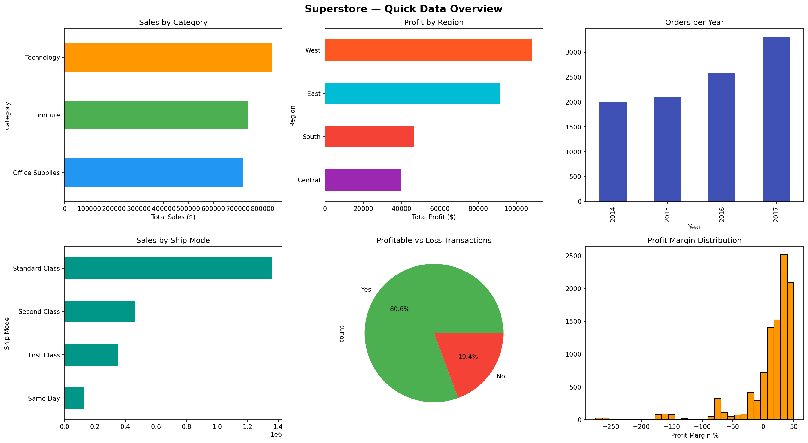
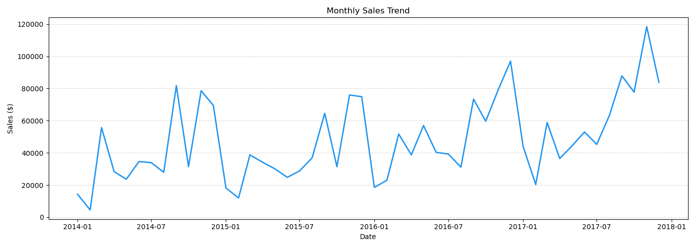
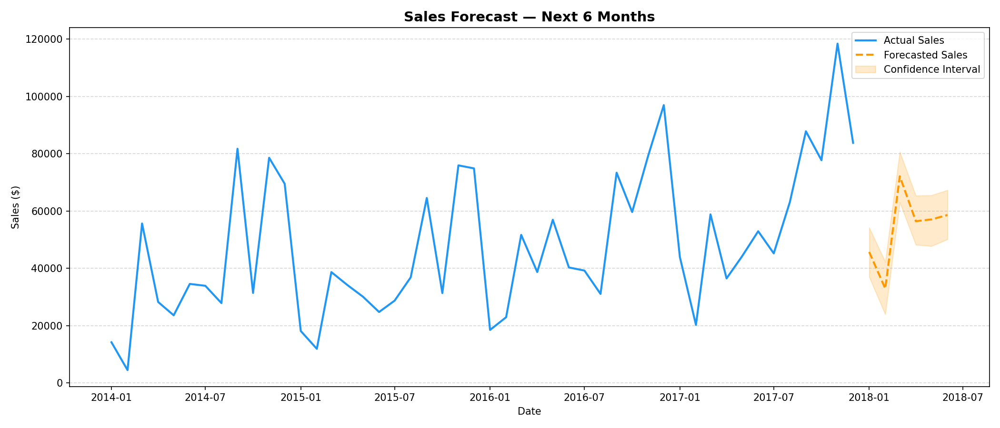

# 🛒 Retail Sales Forecasting Analysis
### Python • MySQL • Power BI • Prophet

---

## 📌 Problem Statement
A retail business wanted to understand their sales performance
across regions, categories and customer segments — and forecast
future revenue to support inventory and marketing decisions.

---


## 🛠️ Tools Used

| Tool | Purpose |
|---|---|
| Python (Pandas, Matplotlib) | Data Cleaning & EDA |
| MySQL | Business SQL Queries |
| Facebook Prophet | Sales Forecasting |
| Power BI | Interactive Dashboard |

---

## 📁 Project Structure

retail-sales-forecasting-analysis/

├── data/

│   ├── superstore.csv

│   └── superstore_cleaned.csv

├── notebooks/

│   ├── 01_data_cleaning.ipynb

│   ├── 02_eda_analysis.ipynb

│   └── 03_forecasting.ipynb

├── sql/

│   └── sales_analysis.sql

├── dashboard/

│   └── retail_dashboard.pbix

├── outputs/

│   └── (all charts and forecast CSV)

└── README.md

---

## 📊 Key Business Insights

1. **Technology** is the top revenue generating category
3. **Consumer segment** drives the highest sales at 50%+
4. **Tables & Bookcases** are the biggest loss making products
5. **Standard Class** shipping is most used but slowest
6. **Q4** consistently shows highest sales every year
7. **6 Month Forecast** predicts consistent revenue growth

---

## 📈 Dashboard Preview





---

## 🚀 How to Run

1. Clone the repo

```bash
git clone https://github.com/surajsalokhe19/retail-sales-forecasting-analysis.git
```

2. Install libraries

```bash
pip install pandas matplotlib seaborn prophet scikit-learn

```

3. Run notebooks in order

01_data_cleaning.ipynb

02_eda_analysis.ipynb

03_forecasting.ipynb


4. Open dashboard   

dashboard/retail_dashboard.pbix


---
## 💡 Business Recommendations

1. Increase pricing by 5-8% on Phones & Storage — low margin vs high demand
2. Discontinue or reprice Tables — causing -$20K loss annually
3. Launch Consumer Loyalty Program — segment drives 50% of revenue
4. Increase inventory before October — November is peak sales month
5. Reduce Standard Class delivery time — most used but slowest at 5+ days
6. Run February clearance sale — forecast shows weakest month ahead
7. Prepare stock for March 2018 — forecast predicts highest revenue month

---

## 📬 Connect with Me
- GitHub: https://github.com/surajsalokhe19